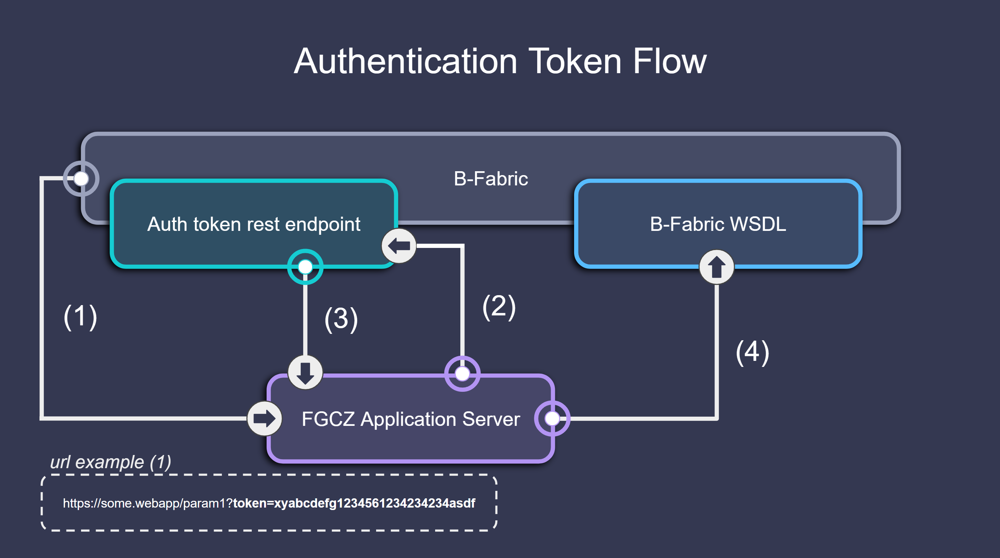
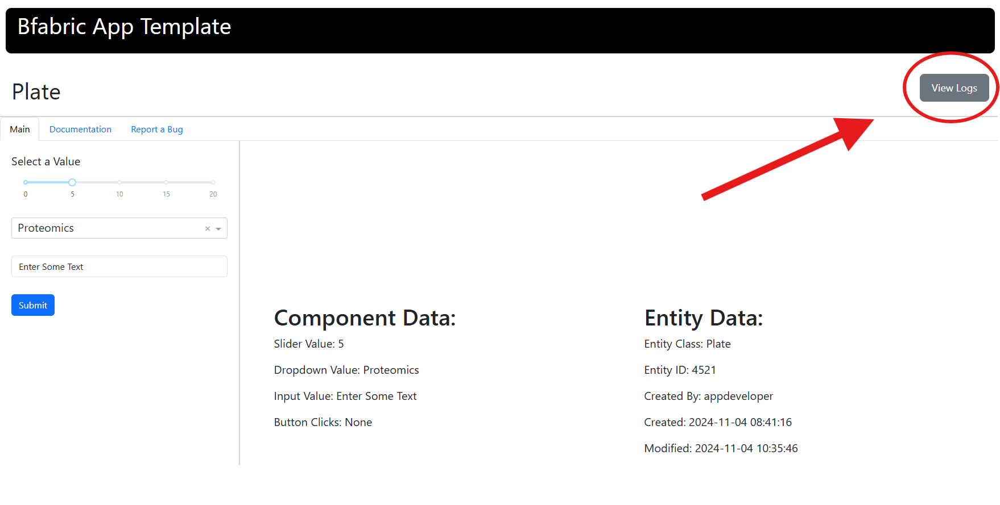

# Bfabric Web Apps Functions

This section provides an in-depth explanation of the **core functions** used in **bfabric\_web\_apps**. These functions are responsible for **authentication, layout management, logging, API interactions, bug reporting** and more.

---
## 1. Application Initialization

### create_app()

The `create_app()` function initializes a **Dash app instance** with pre-configured settings suitable for use with B-Fabric, including responsive design and Bootstrap-based styling. This function simplifies starting a new Dash app by applying common configurations. If you want to explore the implementation of the `create_app()` function in more detail, check out the [source code on GitHub](https://github.com/GWCustom/bfabric-web-apps/blob/main/bfabric_web_apps/utils/app_init.py).

```python
app = create_app()
```
#### Returns:
A Dash app instance with support for dynamic callbacks and responsive design.

---

#### Return type:
`dash.Dash`

---

#### Example Usage

```python
# Import the create_app function from the bfabric_web_apps module.
from bfabric_web_apps import create_app

# Create an instance of the Dash app using the create_app function.
app = create_app()

# Define the layout for the Dash app.
app.layout = get_static_layout(
    app_title,
    app_specific_layout,
    documentation_content
)
```
---

### Understanding the app Object in Dash  
The `app` object is an instance of the [`Dash`](https://dash.plotly.com/) class from the `dash` library. It serves as the central object of a Dash application, managing the layout, callbacks, and overall app configuration. The `Dash()` function is used to create an instance of a Dash application. It initializes the app, providing the structure to define its layout and interactivity. The `Dash()` function serves as the foundation for building Dash applications, allowing developers to add components like HTML elements, interactive controls, and graphs. For more details on defining layouts in Dash, refer to the [Dash Layout Documentation](https://dash.plotly.com/layout#dash-layout).

---

## 2. UI and Layout Management

### get_static_layout()

The `get_static_layout()` function combines various **UI components** into a structured Dash layout with pre-defined tabs for **Main**, **Documentation**, and **Report a Bug**. This layout ensures a consistent look and feel across B-Fabric applications, while allowing customization of the main content and documentation. If you want to explore the implementation of the `get_static_layout()` function in more detail, check out the [source code on GitHub](https://github.com/GWCustom/bfabric-web-apps/blob/main/bfabric_web_apps/layouts/layouts.py#L4).


```python
app.layout = get_static_layout(app_title, main_content, documentation_content)
```

#### Args:
1. **base_title** (*str*, optional): The title displayed in the browser tab. Defaults to `None`.
2. **main_content** (*Dash HTML Component*, optional): The main content displayed in the "Main" tab. Defaults to `None`.
3. **documentation_content** (*Dash HTML Component*, optional): The static documentation displayed under the "Documentation" tab. Defaults to `None`.

---

#### Returns:
A Dash layout containing the specified content along with static tabs for **Main**, **Documentation**, and **Report a Bug**.

---

#### Return type:
`dash.html.Div`

---

#### Example Usage:
```python
# Import the 'html' module from Dash
from dash import html

sidebar = html.Div([...])  # Custom sidebar content
content = html.Div([...])  # Main app content
documentation = html.Div([...])  # Documentation content

# Set the layout of the app
app.layout = get_static_layout("My App", sidebar, documentation)
```

For detailed guidance on implementing and structuring layouts, please refer to the official [Dash documentation](https://dash.plotly.com/layout).

---

## 3. Authentication & Token Handling

### Overview

The B-Fabric authentication flow is designed to be straightforward and seamless for users of the `bfabric_web_app`. While the underlying processes are abstracted, the following provides an overview of how the authentication and token handling works.



#### Steps Explained:

1. **Token Sent to FGCZ Application Server**  
   When a user clicks a link in B-Fabric, they are redirected to the web application's page. The authentication token is included as a parameter in the URL.  
   Example URL:  
   `https://some.webapp/param1?token=xyabcdefg1234561234234234asdf`

2. **Token Validation**  
   The web application sends the token to a dedicated REST endpoint hosted on `fgcz-bfabric.uzh.ch`.

3. **Token Decryption**  
   If the token is valid, B-Fabric responds with a JSON payload containing essential authentication details, such as the username, web service password, and entity class information.

4. **Authenticated API Calls**  
   Now the webapplication has authenticated the user, and can use the username and webserivce password they received from the token auth endpoint, to authenticate subsequent calls to bfabric webservice.

---

### process_url_and_token()

The `process_url_and_token()` function processes URL parameters to extract and validate authentication tokens, retrieve related entity data, and prepare page content for B-Fabric applications. If you want to explore the implementation of the `process_url_and_token()` function in more detail, check out the [source code on GitHub](https://github.com/GWCustom/bfabric-web-apps/blob/main/bfabric_web_apps/utils/callbacks.py#L8).

```python
process_url_and_token(url_params)
```

#### Args:
1. **url_params** (*str*): The URL parameters containing the token (e.g., `"?token=abc123"`).

---

#### Processing Steps:  
1. **Extracts the token**:  
   - Splits the `url_params` string to extract the token value.  
   - If no token is found (`url_params` is empty or doesn't contain `token`), returns `None` for `token`, `token_data`, `entity_data`, and `page_content`, while `page_title` defaults to `" "`.  

2. **Validates the token**:  
   - Uses the `BfabricInterface.token_to_data` method to validate the token.  
   - If the token is expired (`"EXPIRED"`), returns `None` for `token`, `token_data`, `entity_data`, and `page_content`, while `page_title` defaults to `" "`.  
   - If the token is invalid or not found, returns `None` for all outputs except `page_title`, which defaults to `" "`.  

3. **Retrieves token and entity data**:  
   - Parses the token data (`tdata_raw`) using `json.loads` into a dictionary (`tdata`).  
   - Uses `BfabricInterface.entity_data` to fetch entity data based on the token and parses it into a dictionary (`entity_data`).  

4. **Generates page content and title**:  
   - If entity data is valid, generates a session summary (`session_details`) with detailed information about the entity, user, and environment.  
   - Creates a `page_title` based on the token data (`tdata`) and entity data (`entity_data`).  
   - If entity data is missing or invalid, only `token` and `token_data` are returned, while `entity_data` and `page_content` are `None`.  

---

#### Returns:
The function returns a tuple with the following structure:

1. **Authenticated Case**:
   - **Returns**:
     - **token** (*str*): The extracted token string.
     - **token_data** (*dict*): A dictionary containing valid user and environment data.
     - **entity_data** (*dict*): A dictionary with details about the current entity (e.g., name, class, environment).
     - **page_content** (*list*): A session summary as a list of Dash HTML components with details about the entity, user, and environment.
     - **page_title** (*str*): A dynamically generated string based on the token and entity data.
   - **Return Type**:
     - *(str, dict, dict, list, str)*

2. **Authentication Fails**:
   - **Returns**:
     - **token**: `None`
     - **token_data**: `None`
     - **entity_data**: `None`
     - **page_content**: `None`
     - **page_title** (*str*): Defaults to `" "`.
   - **Return Type**:
     - *(None, None, None, None, str)*

---

#### Example Usage - Callback Integration:
This function is typically used within a Dash callback to manage authentication. As reference you can checkout on how this function is used in [`generic_bfabric.py`](https://github.com/GWCustom/bfabric-web-app-template/blob/main/generic_bfabric.py#L44).

```python
# Define a callback for the Dash app
@app.callback(
    [
        Output('token', 'data'),
        Output('token_data', 'data'),       

    ],
    [Input('url', 'search')] 
)
def generic_process_url_and_token(url_params):
    #Processes the URL parameters to extract and return token information
    return process_url_and_token(url_params)
```

---

## 4. Logging

### Overview

Logging in B-Fabric is crucial for tracking user actions, API calls, and errors. Logs are stored in B-Fabric's job history, ensuring transparency, accountability, and effective debugging.

---

### Accessing Logs in B-Fabric  

1. Open the **Job** menu item (see screenshot).  
2. Use filters or search by **Job ID** to find the relevant job.  
3. Click on the **Job ID** to open the job details.  
4. In the job details view, click on the **Log** entry to access all recorded logs for that job.  

  

If the web application is based on the provided **[templates](usage.md)**, there is an additional way to find the logs.

#### Through Web Applications
If the web applications are built using the provided **[templates](usage.md)**, a shortcut to logs is available:  
1. In the application, locate the **button in the top-right corner** (see screenshot).  
2. Clicking this button will **directly open the corresponding logs** for the job.  


  

---

### Initializing a Logger Instance  

A logger instance is essential for tracking user actions, API calls, and errors within B-Fabric. This process ensures accountability and simplifies debugging by maintaining detailed logs of system events.

---

#### get_logger()

The `get_logger()` function extracts logging-related information from `token_data` and initializes a **Logger instance** for managing and storing logs in B-Fabric. If you want to explore the implementation of the `get_logger()` function in more detail, check out the [source code on GitHub](https://github.com/GWCustom/bfabric-web-apps/blob/main/bfabric_web_apps/utils/get_logger.py).

```python
L = get_logger(token_data)
```

##### **Args**:  
1. **token_data** (*dict*): A dictionary containing token information. This is required to associate logs with the corresponding user or session in B-Fabric.

##### **Returns**:  
A logger instance for managing and creating logs.

#### **Return Type:**: 
`Logger`

##### **Example**:

```python
# Check if token data is available
if token_data:
    # Initialize the logger instance
    L = get_logger(token_data)
    
    # Use logger instance to log a simple user action
    L.log_operation("User Login", "User logged in successfully.")
```

---

### Creating Logs: Manual and Automatic Methods  

Logging in B-Fabric enables tracking of system events through two key methods: **manual logging** with `log_operation()` and **automatic logging** with `logthis()`.  

- **Use `log_operation()`** when you need to manually record specific user actions or system events, such as data submissions or logins.
- **Use `logthis()`** when making API calls to automatically log execution details, including function names, input parameters, execution time, and results. This simplifies API monitoring by capturing all relevant context without additional manual logging.  

---

#### log_operation()

The `log_operation()` function allows manual logging of user actions, storing these logs in **B-Fabric's job history**. It is commonly used for tracking specific events, such as data submissions or user logins. If you want to explore the implementation of the `log_operation()` function in more detail, check out the [source code on GitHub](https://github.com/GWCustom/bfabric-web-apps/blob/main/bfabric_web_apps/objects/Logger.py#L69).


```python
L.log_operation(operation, message, params, flush_logs)
```

##### **Args**:  
1. **operation** (*str*): A short event label describing the action (e.g., `"Login"`, `"Update Sample"`).  
2. **message** (*str*): A detailed description of the event.  
3. **params** (*dict*, optional): Additional metadata related to the event. Defaults to `{}`.  
4. **flush_logs** (*bool*): Controls whether logs are immediately sent to the backend. Defaults to `True`.   
   - If `True`: The log entry is appended to the local log storage and immediately flushed to the backend using the `flush_logs()` method. This ensures that the log is recorded in real time.  
   - If `False`: The log entry is stored locally and will remain in the local cache until the next time the `flush_logs()` method is explicitly called. This can be useful for batching multiple log entries to minimize backend calls.

---

##### **Returns**:  
- `None`

---

##### **Example**:

```python
# Check if token data is available
if token_data:
    # Initialize the logger instance
    L = get_logger(token_data)
    # Log a file upload action
    L.log_operation(
        operation ="FileUpload", 
        message = "User uploaded a CSV file",
        params = {"filename": "data.csv"},
        flush_logs = False #The log entry is stored locally
    )
```

---

#### logthis()

The `logthis()` function automatically wraps an API call, logging essential details such as the function name, input parameters, execution time, and return values. This method simplifies logging for API interactions while capturing all necessary context. If you want to explore the implementation of the `logthis()` function in more detail, check out the [source code on GitHub](https://github.com/GWCustom/bfabric-web-apps/blob/main/bfabric_web_apps/objects/Logger.py#L117).

```python
result = L.logthis(api_call, args, obj, flush_logs, kwargs)
```

##### **Args**:  
1. **api_call** (*function*): The API function to execute.  
2. **endpoint** (*str*): The endpoint to read from, e.g. "sample".
3. **obj** (*dict*) A dictionary containing the query, for every field multiple possible values can be provided, the final query requires the condition for each field to be met
4. **flush_logs** (*bool*): Controls whether logs are immediately sent to the backend. Defaults to `True`.   
   - If `True`: The log entry is appended to the local log storage and immediately flushed to the backend using the `flush_logs()` method. This ensures that the log is recorded in real time.  
   - If `False`: The log entry is stored locally and will remain in the local cache until the next time the `flush_logs()` method is explicitly called. This can be useful for batching multiple log entries to minimize backend calls.
5. **kwargs**: These are keyword arguments passed directly to the API call. For example, `max_results` can be used to specify a cap on the number of results to query. If provided as an integer, the number of results will be limited to the specified value. If set to `None`, the code will load all available pages. The function will continue fetching data page by page until either the maximum number of results is reached or all pages have been retrieved.

---

##### **Returns**:  
- **any**: The result of the API call.

---

##### **Return Type**:  
- `any`

---

##### **Example**:

```python
lane_samples = L.logthis(
    api_call = wapper.read,
    endpoint="rununitlane",
    obj={"id": [str(elt["id"]) for elt in lane_data.get("rununitlane", [])]},
    flush_logs = False #The log entry is stored locally
    max_results=None, #Keyword arguments to pass to the API call (kwargs)
)
```

---


### flush_logs()

The `flush_logs()` function is used to send all accumulated log entries to the backend at once and clear the local cache. This function is particularly useful when multiple logging operations have been performed with `flush_logs=False`, allowing logs to be batched and sent in a single request instead of logging each action individually. If no logs are stored, calling this function has no effect. If you want to explore the implementation of the `flush_logs()` function in more detail, check out the [source code on GitHub](https://github.com/GWCustom/bfabric-web-apps/blob/main/bfabric_web_apps/objects/Logger.py#L103).

```python
L.flush_logs()
```

##### **Args**:  
- None

---

##### **Returns**:  
- None

---

##### **Behavior**:  
- If there are **pending logs** saved locally, they are flushed with a **single API call** to the backend, reducing the number of individual requests.
- After a successful flush, the local log storage is cleared.
- If no logs are pending, the function does nothing and exits immediately.

---

##### **Example**:

```python
# Initialize the logger instance
L = get_logger(token_data)

# Log multiple API calls without flushing immediately
entity_data_list = L.logthis(
    api_call=wrapper.read,
    endpoint=endpoint,
    obj={"id": entity_id},
    max_results=None,
    flush_logs=False # Store log locally
)

lane_samples = L.logthis(
    api_call=wrapper.read,
    endpoint="rununitlane",
    obj={"id": [str(elt["id"]) for elt in lane_data.get("rununitlane", [])]},
    max_results=None,
    flush_logs=False # Store log locally
)

# Flush all stored logs at once
L.flush_logs()
```

---

## 5. B-Fabric Power User Access

### get_power_user_wrapper()

Initializes and returns an **authenticated wrapper** for interacting with the **B-Fabric API**. This wrapper is specifically configured for **Power User** access, allowing privileged operations within the system. The default **Power User** login is **`gfeeder`**.

This function uses the environment information provided in `token_data` to determine the appropriate configuration for initializing the `Bfabric` instance. It reads the configuration from a predefined path (`CONFIG_FILE_PATH`) and applies the environment settings.

```python
power_user_wrapper = get_power_user_wrapper(token_data)

```
---
#### Args  
1. **token_data** (*dict*): A dictionary containing token-related information.  
   - The `"environment"` key specifies the environment configuration (e.g., production or testing).  
   - If the `"environment"` key is not provided, it defaults to `"None"`.

---

#### Returns
- **Bfabric**: A `Bfabric` instance, authenticated and configured for the specified environment.

---

#### Example Usage

```python
# Initialize the power user wrapper
power_user_wrapper = get_power_user_wrapper(token_data)
```

---

### Power User Details
- **Username**: **gfeeder**
- **Purpose**: The power user account is used to perform elevated operations in the B-Fabric system, such as reading or modifying restricted data. Ensure that this access is used responsibly and within the bounds of the system's usage policies.

---
## 6. Bug Reports

### Overview

The bug-report functionality within the `bfabric-web-apps` Python library utilizes the Unix command-line utility `mail` to send emails from a running application. 

When the `send_bug_report` function is invoked, **token details, session details, and entity details** are sent as input parameters from the browser cache. These details are aggregated into a `mail_string`, which is then sent to the **bug-report email address** via a system call to the Unix command-line utility `mail`.

**“Mail”** must therefore be active and running on the deployed system, and accessible to the application process for the bug-report functionality to work. 

The default choice of bug-report mail address is **"gwtools@fgcz.system"** which is an OTRS queue, which is only accessible from within FGCZ server hardware. This is adaptable for your own use-case.

---

#### Modifying the Bug-Report Email Address

By default, bug reports are sent to `gwtools@fgcz.system`, but you can customize this to fit your organization's needs. The bug-report email address can be modified as follows:

```python
bfabric_web_apps.BUG_REPORT_EMAIL_ADDRESS = "my_email@my_domain.com" 
```

This change ensures that bug reports are redirected to your preferred email address instead of the default FGCZ system queue.

For further details on modifying global variables, refer to [Chapter 7: Dynamic Variable Configuration](#dynamic-variable-configuration).

---


### submit_bug_report()

Handles the submission of bug reports by delegating the relevant details to the `submit_bug_report()` function.

```python
submit_bug_report(n_clicks, bug_description, token, entity_data)
```

**Args:**
1. **n\_clicks** (int): The number of times the submit button has been clicked.
2. **bug\_description** (str): The description of the bug provided by the user.
3. **token** (str): The authentication token.
4. **entity\_data** (dict): The data related to the current entity.

**Returns:**
- **tuple**: A tuple containing two boolean values indicating success and failure status of the submission.
  - is\_open\_success (bool): Indicates if the bug report submission was successful.
  - is\_open\_failure (bool): Indicates if the bug report submission failed.

#### Example:

```python
@app.callback(
    [
        Output("alert-fade-bug-success", "is_open"),  # Show success alert.
        Output("alert-fade-bug-fail", "is_open")       # Show failure alert.
    ],
    [Input("submit-bug-report", "n_clicks")],          # Detect button clicks.
    [
        State("bug-description", "value"),            # Bug description input.
        State("token", "data"),                       # Authentication token.
        State("entity", "data")                       # Entity metadata.
    ],
    prevent_initial_call=True                            # Prevent callback on initial load.
)
def generic_handle_bug_report(n_clicks, bug_description, token, entity_data):
    return submit_bug_report(n_clicks, bug_description, token, entity_data)
```


## 7. Dynamic Variable Configuration

### Overview

B-Fabric Web Apps provide a set of **global variables** that can be customized by users to adapt the application's behavior to specific needs. These variables control aspects such as configuration file paths, email addresses for support, server settings, and the development environment state.

This chapter explains how to modify these variables and where they are stored.

---

### List of Configurable Variables

The following global variables can be modified in B-Fabric Web Apps:

| Variable                                    | Default Value                                        | Description                                                       |
| ------------------------------------------- | ---------------------------------------------------- | ----------------------------------------------------------------- |
| bfabric_web_apps.CONFIG_FILE_PATH         | "\~/.bfabricpy.yml"                                  | Path to the configuration file used by the application.           |
| bfabric_web_apps.DEVELOPER_EMAIL_ADDRESS  | "griffin\@gwcustom.com"                              | Email address for development-related inquiries.                  |
| bfabric_web_apps.BUG_REPORT_EMAIL_ADDRESS | "gwtools@fgcz.system" | Email address for submitting bug reports.                         |
| HOST                                      | '0.0.0.0'                                            | The IP address where the Dash app is hosted.                      |
| PORT                                      | 8050                                                 | The port number used by the Dash server.                          |
| DEV                                       | False                                                | Indicates whether the application is running in development mode. |

---

### How to Modify Global Variables

You can modify these global variables within your script before initializing the application.

#### Change the Configuration File Path

```python
bfabric_web_apps.CONFIG_FILE_PATH = "~/custom_config.yml"
```

#### Update Developer Email Address

```python
bfabric_web_apps.DEVELOPER_EMAIL_ADDRESS = "support@mydomain.com"
```

#### Update Bug Report Email Address

```python
bfabric_web_apps.BUG_REPORT_EMAIL_ADDRESS = "bugs@mydomain.com"
```

#### Change Host and Port Settings

```python
HOST = "127.0.0.1"
PORT = 8080
```

#### Enable Development Mode

```python
DEV = True
```

These settings allow customization of the application behavior to fit different use cases, such as development, testing, or production environments.

---

