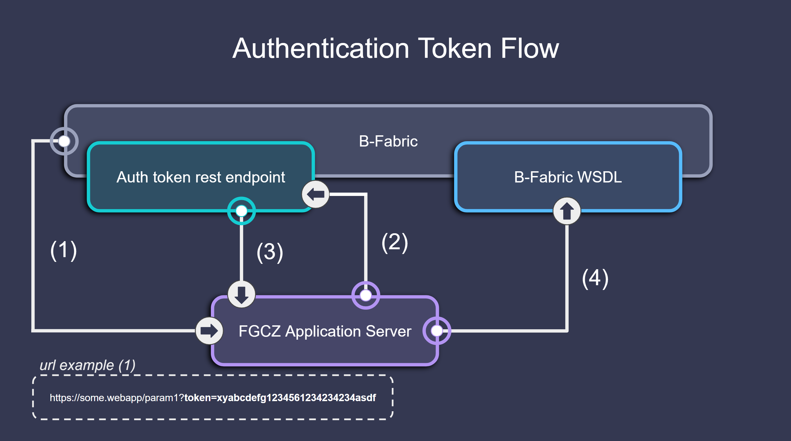

# Important Components

This section introduces the most critical variables and data structures used in a B-Fabric Web App session. These components are automatically extracted from the B-Fabric token and are reused across callbacks to personalize and configure the session dynamically.

---

## App Data

**App data** holds metadata about the currently running web application.

Example:
```python
app_data = {
    'id': 543,
    'name': 'RNAseq',
    'description': 'A web application designed to run the nf-core RNA-seq pipeline.'
}
```

---

## Entity Data

**Entity data** describes the dataset or project associated with the app session. This typically includes metadata, sample information, and file references.

Example:
```python
entity_data = {
    'name': 'Uploaded FASTQ Dataset (Run 1913)',
    'createdby': 'lopitz',
    'created': '2013-03-28 13:27:49',
    'modified': '2025-04-16 13:01:14',
    'full_api_response': {...}  # Full dataset metadata
}
```

---

## Token Data

**Token data** includes session metadata, such as the authenticated user, session expiry time, application info, and dataset ID.

Example:
```python
token_data = {
    'environment': 'Test',
    'user_data': 'appdeveloper',
    'token_expires': '2025-05-01 22:54:56',
    'entity_id_data': '2220',
    'entityClass_data': 'Dataset',
    'webbase_data': 'https://fgcz-bfabric-test.uzh.ch/bfabric',
    'application_params_data': {},
    'application_data': '543',
    'userWsPassword': 'dummypassword',
    'jobId': '2010'
}
```

---

Here's the updated **Charge Switch** section you can seamlessly integrate into your **Important Components** chapter. This detailed description clearly explains the charge switch's purpose, its UI implementation, and the related backend functionality:

---

## Charge Switch

The **Charge Switch** is a UI component that allows users or developers to control whether a B-Fabric application run should be charged to a specific project or container. When enabled, costs associated with running the application are automatically allocated to the selected B-Fabric project or container.

### Sidebar UI Implementation

To easily integrate the charge switch into your Dash application's sidebar, use the following predefined component from the `bfabric_web_apps` library:

```python
from bfabric_web_apps.components import charge_switch

sidebar = charge_switch + [
    html.P("Select Lane:"),
    dcc.Dropdown(
        id="lane-dropdown",
        options=[],  # Populate dynamically
        value=None,
    ),
    html.Br(),
    html.P("Submit job to which queue?"),
    dcc.Dropdown(
        options=[
            {'label': 'light', 'value': 'light'},
            {'label': 'heavy', 'value': 'heavy'}
        ],
        value='light',
        id='queue'
    ),
    html.Br(),
    dbc.Button('Submit', id='example-button'),
]
```


---

## Authentication & Token Handling

The B-Fabric authentication system ensures secure access and links users to specific datasets and apps.



### Flow Overview

1. **Token sent via URL**  
   `https://some.webapp/param1?token=abcxyz123`

2. **Web app validates the token** using FGCZ’s REST endpoint.

3. **B-Fabric responds** with a JSON payload of auth data.

4. **Web app uses credentials** to fetch entity and app metadata.

---

### process_url_and_token()

This utility extracts token data from the URL and populates global variables.

```python
process_url_and_token(url_params)
```

### Return Tuple:
```python
(token, token_data, entity_data, app_data, page_title, session_details, job_link)
```

---

## Example Dash Callback

```python
@app.callback(
    [
        Output('token', 'data'),
        Output('token_data', 'data'),
        Output('entity', 'data'),
        Output('app_data', 'data'),
        Output('page-title', 'children'),
        Output('session-details', 'children'),
        Output('dynamic-link', 'href')
    ],
    [Input('url', 'search')]
)
def generic_process_url_and_token(url_params):
    return process_url_and_token(url_params)
```